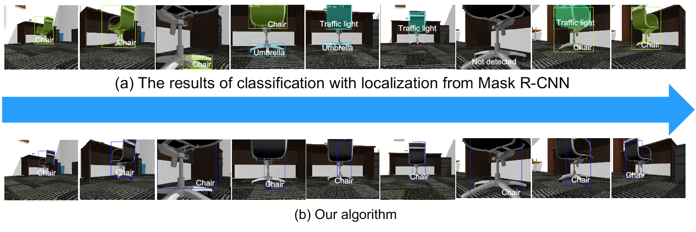

# An Objectness Score for Accurate and Fast Detection for Navigation

This is a ROS package of [An Objectness Score for Accurate an Fast Detection for Navigation](http://www.i-asem.org/publication_conf/anbre19/W5A.3.RR1722_5564F1.pdf).

## Requirements
* ROS kinetic
* Ubuntu 16.04
* [ROS package of Mask R-CNN](https://github.com/qixuxiang/mask_rcnn_ros)
* [ROS package of turtlebot](https://github.com/turtlebot/turtlebot)
* [ROS package of turtlebot_simulator](https://github.com/turtlebot/turtlebot_simulator)

## Run 
```bash
rosrun objctness_score objectness_score
```

## Test results

